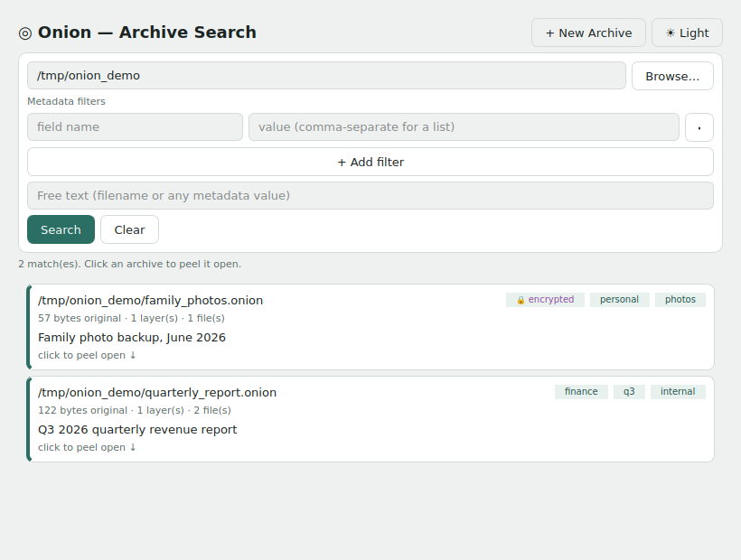
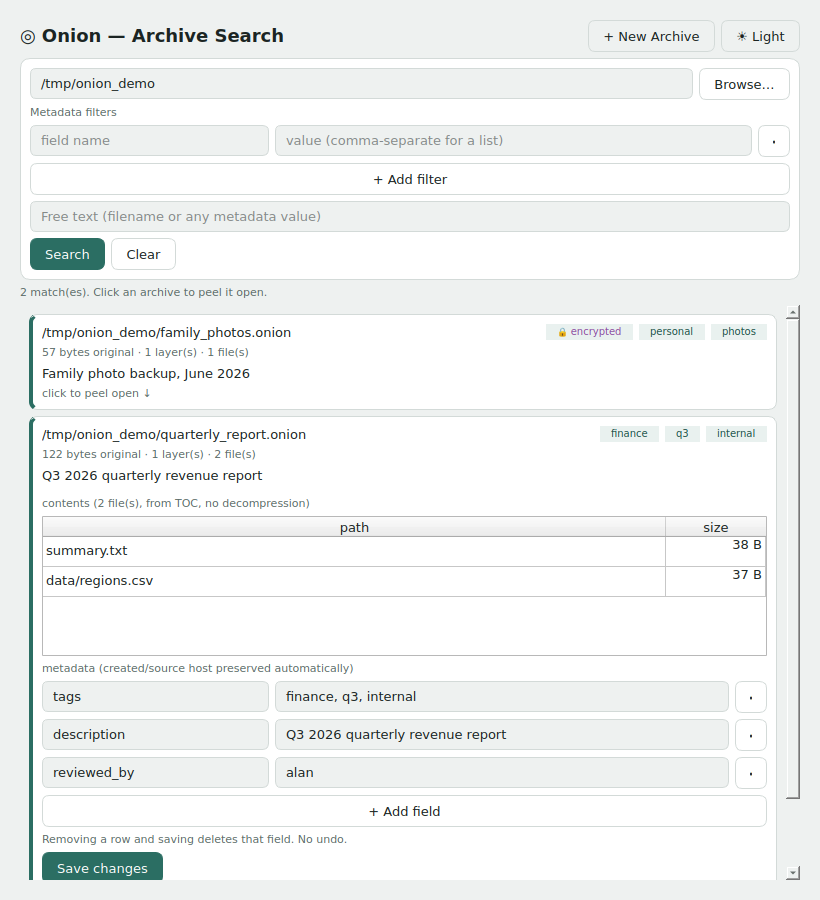

# Onion 🧅

**A Local Metadata & Search System, Built on a Compressed, Self-Describing Archive Format**

What started as an adaptive compression engine has grown into something
closer to a small filesystem extension: compress and encrypt files, tag
them with searchable metadata, and query thousands of archives by tag,
description, or filename — without ever decompressing one — through a
CLI, a web UI, a native desktop app, or an interactive shell, all backed
by a persistent local daemon that remembers what you've told it between
sessions.

*v0.1.0 — A. Hill*

---

<p align="center">
  
  &nbsp;&nbsp;
  
</p>
<p align="center"><em>The PyQt6 desktop UI (<code>onion --qt</code>) — the web UI (<code>onion --web</code>) looks the same, in a browser.</em></p>

---

## What Onion actually is now

It began as one thing — an adaptive layered compression engine — and the
compression side of it is still solid on its own terms (see the
[algorithms table](#algorithms) below). But the part that turned out to
matter more is the **wrapper**: every `.onion` file carries a readable,
searchable metadata block, and that idea has since grown outward into a
small system in its own right, not just a file format:

- **Four ways in** — a scriptable CLI, a browser-based UI, a native
  PyQt6 desktop app, and an interactive shell with its own guided,
  live-feedback search — all calling the same core, none of them a
  reimplementation of the others.
- **A persistent background daemon** (`oniond`), started automatically
  and left running between sessions, holding a real base table of
  watched directories rather than re-scanning the filesystem cold on
  every query.
- **A domain-specific shell** that stays out of the way of the OS it's
  running on — ordinary commands (`mv`, `cp`, `ls`, `move`, `copy`, ...)
  pass straight through to the real shell underneath, cross-platform.
- **Encryption, signing, and verification** as first-class parts of the
  same metadata wrapper, not bolted on separately.

None of that makes the compression engine less real — it's still there,
still does the job, still documented in full below. It just isn't the
whole story anymore. The sections below cover it roughly in the order
the system grew: the wrapper concept first (since everything else is
built on it), then compression internals, then the CLI, then the web/
desktop/shell frontends and the daemon underneath them.

---

## The real strength: the wrapper

Anyone can compress. `gzip`, `lz4`, `zstd` — compression is a solved,
commoditised problem. **What Onion adds is the wrapper** — and, as of
the frontends and daemon above, a real system built directly on top of
that wrapper, not just a format that would let someone else build one.

Every `.onion` file carries a readable header and metadata block that
describes what is inside *before you open it*. No decompression required.
A search routine scanning thousands of archives can read the wrapper of
each one in microseconds and decide whether the content is relevant —
then only decompress the ones it actually needs. This is exactly what
`--search`, the guided shell search, and the daemon's persistent base
table all actually do today, not a hypothetical capability the format
merely permits.

This is the invention. Not the compression algorithm. The header.

**What the wrapper enables:**

- **Selective extraction** — a search tool reads wrappers across an entire
  archive store and opens only the files matching its query. No wasted
  decompression.

- **Data cataloguing** — a collection of `.onion` files is self-cataloguing.
  Read the wrappers, build an index, query the index. The files themselves
  never need to be opened until a result is needed. The daemon's watched-
  directories base table (see the shell section below) is exactly this,
  built and running, not just a property the format happens to allow.

- **Schema declaration** — for structured data (SQL tables, sensor logs,
  concept graph data), the wrapper declares the domain, the concepts
  inside, the row count, the confidence level of the data. A consumer
  knows whether this file is useful before paying any I/O cost.

- **Post-hoc metadata** — the wrapper can be updated without recompressing
  the payload. Tag a file, add a description, update a reference — O(metadata
  size), not O(file size).

- **Verifiability** — signed metadata means the wrapper itself is
  trustworthy. You know not just what the file claims to contain but
  that the claim has not been tampered with.

**For the UniCell concept graph specifically:** when empirical data tables
are wrapped with Onion, the wrapper declares which concepts they contain
(using concept index IDs), which domain they belong to, and the average
empirical confidence of the mechanisms they inform. The inference engine
reads wrappers to find relevant data without opening any compressed file.
A table catalogue is just a collection of wrappers — trivially cheap to
maintain, trivially fast to search.

The compression ratio matters. The wrapper is what makes Onion
architecturally useful rather than just fast.

---

## What is it?

Onion is a standalone file compression engine that controls the entire pipeline
from analysis to bitstream output. No compatibility compromises with zip/7z —
you own the format, the algorithms, and the metadata.

Files are wrapped in layers like an onion. Each layer is a compression or
encryption transformation. The engine decides which layers to apply and in
what order, then prunes any layer that doesn't help. The final archive is
self-describing: it carries its own compression recipe, file manifest, and
optionally signed metadata — all readable without extracting.

---

## Install

```bash
# Install dependencies
pip install cryptography

# Build C extensions (LZ77 + Huffman — required for usable performance)
python build_ext.py build_ext --inplace

# Install as a command
pip install -e .
```

---

## Quick start

```bash
# Compress a file
onion -c report.pdf

# Compress a directory
onion -c my_project/

# Decompress
onion -d my_project.onion

# Remove the wrapper -- restores the original, deletes the .onion
onion --unwrap my_project.onion

# Inspect without extracting
onion -i my_project.onion

# Search a folder of archives by metadata — no decompression
onion --search ~/archives --meta tags=invoice

# Point-and-click search/browse UI in your browser
onion --web ~/archives

# Or as a native desktop app (requires: pip install PyQt6)
onion --qt ~/archives

# Or just type 'onion' with no arguments -- drops into the interactive shell
onion
```

---

## Archive format: `.onion`

Every archive is fully self-describing:

```
[ONION header]      magic, version, original size & CRC32, layer count
[Layer descriptors] one per active layer — algo ID, compressed size, CRC32
[Payload]           compressed data (output of final layer)
[AUDT block]        optional JSON recipe — what ran, what each layer gained
[META block]        optional metadata — author, tags, HMAC signature, etc.
```

Backward compatible by design: older decompressors ignore unknown trailing
blocks. The format version in the header means future algorithm updates can
still read today's archives.

---

## Algorithms

| ID   | Name               | Best for                            |
|------|--------------------|--------------------------------------|
| 0x00 | Raw                | Already-compressed files, `--no-compress` |
| 0x01 | RLE                | Repeated byte runs, sparse data     |
| 0x02 | LZ77               | General text, code, documents (32KB window, hash-chain match finder) |
| 0x03 | Huffman            | After LZ77 (skewed symbol dist.)    |
| 0x04 | AES-256-GCM        | Encryption — always the last layer  |
| 0x05 | Delta              | Structured binary/numeric data (sensor logs, float arrays, time-series) |
| 0x06 | LZMA               | Text/code/JSON — replaces LZ77+Huffman, ~98% reduction |
| 0x07 | LZ4                | `--fast` mode — microsecond speed, slightly lower ratio |
| 0x08 | LZ77+SplitHuffman  | Experimental, opt-in only — see dedicated section below |

LZ77 and Huffman are backed by C extensions (60–278× faster than pure
Python). Pure-Python fallbacks are included for environments where the
extensions haven't been built. Split-stream Huffman (0x08) is pure
Python only — see below for why that matters.

---

### Split-stream Huffman: `--split-huffman`

An experimental alternative to the default "LZ77 → Huffman" pipeline,
built as a standalone algorithm the same way LZMA is — not a
modification of LZ77 or Huffman, a self-contained third option. Uses its
own LZ77 tokenizer and Huffman-codes the literal/match-length stream
with its own tree, separate from match distances.

**Never selected automatically.** The Strategist's normal decision tree
never picks this — it only runs when explicitly requested via
`--split-huffman` (CLI) or the checkbox in the web UI's "+ New Archive"
dialog. This is deliberate, not a missing feature: it is genuinely not a
universal improvement.

**Measured** against the default C-accelerated LZ77+Huffman pipeline
across six representative data types:

| Data type | vs. default |
|-----------|--------------|
| Random / incompressible data | ~5% smaller |
| Highly repetitive patterns | ~56% smaller |
| JSON-like structured data | ~1% smaller |
| General structured log/text | ~6% **larger** |
| Real source code | ~4% **larger** |
| Small files (under ~1KB) | ~30–40% **larger** |

There's no reliable way to predict which way it'll go for a given file
without trying it — small files lose to fixed per-stream header
overhead; typical prose/code doesn't have a skewed-enough match-distance
distribution to offset that overhead; highly repetitive or
near-random data benefit the most.

**Also meaningfully slower** — pure Python, no C extension. Expect
noticeably longer compress times than the default, especially on larger
files (the web UI shows a time warning when this checkbox is ticked).

```bash
# Try it and compare against the default
onion -c data.bin --split-huffman -o data_split.onion
onion -c data.bin -o data_default.onion
ls -la data_split.onion data_default.onion
```

Two real bugs were found and fixed while building this (not just
theorised about — both confirmed with before/after measurements):
naively Huffman-coding raw match distances made files dramatically
*larger* on typical text (thousands of near-unique distance values cost
more in header overhead than they save — fixed with an adaptive mode
that tries both a raw and a Huffman encoding of the distances and keeps
whichever is smaller); and a naive brute-force matcher didn't just run
slower than the C-accelerated default, it could *hang* — 20KB of a
repeated byte failed to complete in 60 seconds. Replaced with a
hash-chain matcher (capped candidate search per position), fixing that
specific case to under 0.01s.

---

## How it works

### Phase 1 — The Strategist
Analyses the input before touching it:
- Measures Shannon entropy — high entropy means already compressed, skip layers
- Scans for RLE opportunity (runs of repeated bytes ≥ 3)
- Measures dictionary compressibility via bigram frequency coverage
- Produces an ordered Instruction Set

### Phase 2 — The Transformer
Executes each layer with a **Gain Monitor**:
- If a layer doesn't reduce file size → pruned, never written
- Encryption layers are never pruned (authentication overhead is by design)
- If all layers are pruned → falls back to Raw (file is always a valid archive)
- Writes atomically: temp file → rename, so a crash never corrupts an archive

### The Audit Block
An optional JSON block recording the full compression recipe:
- Original size and entropy score
- Which layers ran, were pruned, or failed
- Input/output size and gain at each step

### The Metadata Block
An optional trailing block carrying arbitrary key-value metadata:
- Auto-populated: `created` (UTC timestamp), `source_host` (hostname)
- User-supplied: any key=value pairs via `--meta`
- HMAC-SHA256 signing: signs everything before the META block
- Post-hoc editable: update metadata without recompressing the payload

### The TOC Block
An optional trailing block listing a directory archive's contents —
just `{path, size}` per file, written between the Audit block and the
Metadata block. Lets a directory archive's file list be read instantly
on archives of any size, with zero decompression, the same design
principle as the Metadata block applied to directory contents instead
of user tags. Present even on **encrypted** archives, since it sits
outside the encrypted payload entirely — `-i` and `--search` can show
you what's inside an encrypted archive without the password. Only
written for multi-file/directory archives; a plain single-file compress
has no TOC block (there's only one file, and its name isn't part of the
archive format in that mode).

---

## Full CLI reference

### Compress: `-c`

```bash
onion -c <file>
onion -c <directory>
onion -c <file1> <file2> <dir1> ...
```

**Options:**

| Flag | Description |
|------|-------------|
| `-o <path>` | Output path (default: `<name>.onion`) |
| `-e` | Encrypt with AES-256-GCM (prompts for password) |
| `-p <password>` | Password for encryption (skips prompt — useful for scripting) |
| `--sign-key <key>` | HMAC-SHA256 sign the archive with this key |
| `--meta key=value` | Add metadata (repeatable — see Metadata section) |
| `--exclude <pattern>` | Exclude files matching glob pattern (repeatable) |
| `--no-default-ignores` | Disable built-in ignore list |
| `--no-audit` | Omit the audit block from the archive |
| `--no-compress` | Store the payload raw, skip compression entirely — independent of encryption (unlike `--encrypt-only`, does not require `-e`). The header/TOC/META wrapper still applies, so the file stays fully searchable via `--search`/`-i` without ever being compressed. |

**Examples:**

```bash
# Compress a single file
onion -c report.pdf

# Compress a directory to a named archive
onion -c my_project/ -o backup.onion

# Compress and encrypt (interactive password prompt)
onion -c sensitive/ -e

# Compress, encrypt, and sign — non-interactive (for scripting)
onion -c footage/ -e -p "enc_password" --sign-key "hmac_secret"

# Compress with metadata
onion -c footage/ \
  --meta author="A. Hill" \
  --meta description="Nightly bundle — 14 Acacia Road" \
  --meta tags="cctv,void,june-2026" \
  --meta ref="case-2026-001" \
  --sign-key "shared_secret"

# Compress multiple files
onion -c file1.py file2.py config.json

# Exclude patterns (on top of built-in defaults)
onion -c my_project/ --exclude "*.log" --exclude "tmp/"

# Compress everything including normally-ignored files
onion -c my_project/ --no-default-ignores
```

---

### Decompress: `-d`

```bash
onion -d <file.onion>
```

Auto-detects whether the archive is encrypted from the header — prompts
for a password automatically if needed. Auto-detects whether the payload
is a single file or a directory bundle and extracts accordingly.

**Options:**

| Flag | Description |
|------|-------------|
| `-o <path>` | Output path or directory (default: auto) |
| `-p <password>` | Password for encrypted archives (skips prompt) |

**Examples:**

```bash
# Decompress (auto output path)
onion -d my_project.onion

# Decompress to a specific directory
onion -d my_project.onion -o /tmp/restored/

# Decrypt non-interactively
onion -d sensitive.onion -p "enc_password"
```

---

### Inspect: `-i`

```bash
onion -i <file.onion>
```

Shows the full archive structure without extracting:
- Header: original size, CRC32, encryption flag, layer count
- Per-layer: algorithm name, compressed size, CRC32
- Contents: full file listing with individual sizes (unencrypted archives)
- Audit block: compression recipe JSON
- Metadata block: all key-value pairs (HMAC truncated — use `--verify` to check)

**Examples:**

```bash
onion -i archive.onion
onion -i backup.onion
```

---

### Update metadata: `--set-meta`

```bash
onion --set-meta <file.onion> --meta key=value [--meta key=value ...]
```

Updates the META block **without recompressing the payload** — O(block size),
not O(file size). By default merges new keys into existing metadata, preserving
fields like `created` and `source_host`.

**Options:**

| Flag | Description |
|------|-------------|
| `--meta key=value` | Key-value pair to set/update (repeatable) |
| `--replace` | Replace all metadata instead of merging |
| `--sign-key <key>` | Re-sign the archive after update |
| `-p <password>` | Alias for `--sign-key` |

**Examples:**

```bash
# Add a field to existing metadata
onion --set-meta archive.onion --meta status="reviewed" --meta reviewer="J. Smith"

# Update description and re-sign
onion --set-meta archive.onion --meta description="Updated desc" --sign-key "secret"

# Replace all metadata from scratch
onion --set-meta archive.onion --replace \
  --meta author="A. Hill" \
  --meta created="2026-06-14T18:00:00Z"
```

---

### Verify signature: `--verify`

```bash
onion --verify <file.onion> [--sign-key <key>]
```

Verifies the HMAC-SHA256 signature against the archive. The HMAC covers
everything before the META block (header + payload + audit), so any
modification to the archive content will fail verification.

Exit codes: `0` = valid, `1` = error (no HMAC / bad archive), `2` = invalid signature.

**Options:**

| Flag | Description |
|------|-------------|
| `--sign-key <key>` | Key to verify against (prompts if omitted) |
| `-p <password>` | Alias for `--sign-key` |

**Examples:**

```bash
# Verify interactively (prompts for key)
onion --verify archive.onion

# Verify non-interactively
onion --verify archive.onion --sign-key "shared_secret"

# Use in a script — check exit code
onion --verify footage.onion -p "secret" && echo "OK" || echo "TAMPERED"
```

---

### Remove wrapper: `--unwrap`

```bash
onion --unwrap <file.onion> [-p <password>]
```

Restores the original file(s) exactly, then **deletes the .onion archive**.
Distinct from `--delete` below: no data is lost — this undoes the
wrapper, giving you your original file(s) back, rather than throwing
anything away. If the archive is encrypted, the password is required
(prompts if not given via `-p`). Refuses to overwrite an existing
file/directory at the destination rather than silently clobbering it.

```bash
# Unwrap a single file — restores report.pdf, deletes report.pdf.onion
onion --unwrap report.pdf.onion

# Unwrap an encrypted directory archive
onion --unwrap project.onion -p "secret"
```

---

### Delete an archive: `--delete`

```bash
onion --delete <file.onion> [--yes]
```

Permanently deletes the `.onion` archive with **no extraction** —
irreversible. Prompts for confirmation (`Type 'yes' to confirm:`) unless
`--yes` is given, for scripting.

```bash
# Interactive (asks for confirmation)
onion --delete old_backup.onion

# Scripted — skip the confirmation prompt
onion --delete old_backup.onion --yes
```

---

### Search archives: `--search`

```bash
onion --search <path> [path...] [--meta key=value]... [--any text] [--no-recursive]
```

Scans one or more paths for `.onion` files and filters them by metadata —
**without decompressing anything**. Reads only the header, Audit block,
TOC block, and Metadata block for each archive: a header parse, a couple
of short JSON blobs, done. Cost scales with the number of archives, not
their total compressed size.

**Options:**

| Flag | Description |
|------|-------------|
| `--meta key=value` | Require this field to match (repeatable, AND semantics). `tags=x` matches an archive tagged `[x, ...]`; `tags=x,y` requires both present |
| `--any <text>` | Case-insensitive substring match against filename, any metadata value, **and** any filename inside a directory archive's TOC block |
| `--no-recursive` | Only scan the given path(s) themselves, not subdirectories |

**Examples:**

```bash
# Everything tagged "invoice"
onion --search ~/archives --meta tags=invoice

# Both tags required
onion --search ~/archives --meta tags=invoice,q3

# Freetext across metadata AND filenames inside directory archives
onion --search ~/archives --any main.py

# No filters at all — list everything found
onion --search ~/archives
```

Payload-blind by design: finding archives by tag, description, or a
filename inside a directory archive never triggers a single decompression
call. Searching actual file *content* (not just names) would require
decompressing the payload and is out of scope here.

---

### Web UI: `--web`

```bash
onion --web <path> [path...] [--port 8000]
```

Launches a local, dependency-free web server (Python's stdlib
`http.server` — no Flask/FastAPI, nothing to `pip install`) serving a
single-page search-and-browse UI at `http://127.0.0.1:<port>/`.

- **Search & browse** — the same metadata/freetext filtering as
  `--search`, with results shown as cards you click to "peel open" and
  reveal a directory archive's contents (from the TOC block, no
  decompression).
- **Folder picker** — a "Browse…" button opens a point-and-click folder
  navigator (breadcrumb + subfolder list) instead of requiring you to
  type an exact path. Server-side by design: the server binds to
  `127.0.0.1` only, so this is no more permissive than `--search` already
  is on any path the server process can read.
- **Create archives** — a "+ New Archive" button opens a file/folder
  checkbox picker (selection persists as you navigate between folders,
  matching what the CLI's mixed-path compress already supports), a
  password field (blank = no encryption), a "No compression (store raw)"
  checkbox for search-only wrapping without running any compression
  algorithm, an experimental "split-stream Huffman" checkbox (with an
  inline time warning that appears when ticked — pure Python, genuinely
  mixed results, see the dedicated section above before relying on it),
  a destination field, and the same metadata editor used elsewhere.
  Calls the same `analyse()` → `compress_files()` pipeline the CLI uses,
  not a separate reimplementation of it.
- **Encrypted archives** show a 🔒 lock icon in the results.
- **Signature display** — an HMAC signature (if present) is shown
  read-only (truncated hash, full value on hover) with a key field and
  "Verify" button. Starts as "present, unverified"; updates to "present
  and confirmed" or "invalid signature" after a real check against
  `/api/verify`. No signing-key input for *creating* a signature exists
  in the browser yet — that's still CLI-only (`--sign-key`), deliberately,
  since typing a signing key into a web form casually felt like the
  wrong default.
- **Metadata editor** — peel a card open to edit, add, or delete
  metadata fields directly, no CLI round-trip needed. Deleting a field
  and saving really deletes it (not just an add/overwrite merge).
  `created`/`source_host` are preserved automatically; an existing HMAC
  signature is correctly dropped on edit rather than silently surviving
  as a now-stale signature.
- **Remove wrapper / Delete** — two distinct, clearly separate buttons
  per card. "Remove wrapper" restores the original file(s) and deletes
  the archive (no data lost — undoes the wrapper). "Delete archive"
  permanently removes the `.onion` with no extraction; requires a
  real two-step confirmation in the page itself (button becomes "Really
  delete? Click again" for 6 seconds, not a single click and not just
  the browser's native confirm dialog), and the API independently
  requires an explicit confirmation flag too.
- **Light/dark theme**, remembered across visits.
- **Touch-aware** — proper tap target sizing, visible tap feedback
  (there's no `:hover` on a touchscreen), and the iOS Safari input-zoom
  fix, for use on a tablet or touchscreen PC as well as a mouse/keyboard.

```bash
# Browse and search everything under ~/archives
onion --web ~/archives

# Custom port
onion --web ~/archives --port 8080
```

---

### Desktop UI: `--qt`

```bash
pip install PyQt6      # or: pip install onion-compress[qt]
onion --qt [path...]
```

A native desktop alternative to `--web`, matching it as closely as Qt's
styling model allows (same colour palette, same feature set: search,
browse, create archives, peel-open cards with TOC/signature/metadata,
unwrap, delete). PyQt6 is an optional extra, not a hard dependency — the
CLI, `--search`, and `--web` all work without it; `--qt` gives a clear
install message if PyQt6 isn't present rather than a confusing traceback.

Calls `ace.search`/`ace.transformer`/`ace.analyser` directly, in-process
— there's no local server involved the way `--web` uses one, since a
desktop app doesn't need an HTTP layer between itself and the same
Python functions. Every disk-touching action (search, compress, unwrap,
delete, verify) runs on a background thread so the window never freezes.

Differences from the web UI, by necessity rather than choice:
- File/folder selection for "+ New Archive" uses native OS file/folder
  pickers (`QFileDialog`) rather than the web UI's custom breadcrumb
  navigator — the idiomatic Qt approach, and it covers the same ground.
- No touch-specific tuning (tap target sizing, iOS zoom fix, etc.) —
  those were browser/mobile-specific concerns that don't apply to a
  native desktop window.

```bash
# Launch, starting at a specific folder
onion --qt ~/archives

# Launch with no path -- starts at your home directory
onion --qt
```

---

### Interactive shell: `--shell` (also the default — bare `onion`)

```bash
onion            # bare, no flags -- drops straight into the shell
onion --shell    # same thing, explicit
```

A domain-specific interactive prompt — same category as `sqlite3`'s or
`redis-cli`'s REPL, **not** a general-purpose shell replacing bash or
PowerShell. The prompt (`onion:/current/path>`) makes it visually plain
you're inside Onion's own command space, cleanly separate from the
surrounding OS shell. Commands drop the `onion`/`--` prefix since
there's no ambiguity about which program you're talking to:

```
onion:~/archives> search tags=invoice
onion:~/archives> cd ../photos
onion:~/photos> compress vacation.jpg -e
onion:~/photos> web
onion:~/photos> exit
```

| Command | Does |
|---|---|
| `search` (no arguments) | **guided live search** — type a term, get instant green/yellow/red feedback, Tab to add another term, Enter to run. See below. |
| `search [key=value ...] [text ...]` | one-shot search — `key=value` filters by metadata, any other bare word is freetext (`any` is accepted but optional: `search invoice` and `search any invoice` do the same thing) |
| `cd <path>` / `pwd` | move around / show the current directory |
| `compress <path> [-e] [-p pw] [--meta k=v ...]` | compress a file/folder here |
| `web` / `qt` | launch the other frontends here, as a separate process |
| `daemon status` / `daemon stop` | check or stop the background daemon |
| *anything else* (`mv`, `cp`, `ls`, `dir`, `move`, `copy`, ...) | passes straight through to the real OS shell, using this shell's current directory |
| `help` | this list, inside the shell |
| `exit` / `quit` | leave the shell |

**Guided live search** (bare `search`, needs `pip install prompt_toolkit`
— falls back to the old "list everything" behaviour with a note if it
isn't installed): type a term and watch it turn **green** the moment it
matches something already known from the archives here (a tag, a
description, a filename inside a directory archive's TOC), **yellow**
while a background deep search checks whether a full scan finds it
anyway, or **red** if that deep search also comes up empty — genuinely
not found, not just "not indexed yet." A running **"N directories,
M files"** count at the top shows how far your terms so far are
narrowing things down — recomputed each time Tab commits another term,
starting from a baseline count (everything here) before you've typed
anything. Tab commits the term and starts the next one; Enter runs the
accumulated search and shows full paths; Ctrl-C cancels outright with
nothing run. This is the "progressive/type-ahead search" idea from
the sidecar/semantic-index design note realised as an actual shell
feature — currently in its simplest form (a plain scan for the fast
index, not yet a persistent one).

**Backed by a persistent local daemon (`oniond`)**, started automatically
the first time it's needed and left running afterward — the same
pattern as `dockerd` outliving the `docker` CLI, not tied to any one
shell session. Repeated searches in a session hit a warm cache instead
of cold-scanning the filesystem every time. Any other Onion process on
the same machine (a second shell, a script) discovers and shares the
same daemon automatically via a small state file
(`~/.onion/daemon.json`) — no configuration needed for that part.

**Watched directories — a real persistent base table**, not just a
cache: `daemon watch <path>` adds a directory the daemon scans once and
keeps in memory across sessions, surviving daemon restarts via a plain
text config file (`~/.onion/watched_dirs.txt`, one path per line, `#`
comments allowed, hand-editable — the daemon re-reads it on startup).

| Command | Does |
|---|---|
| `daemon watch <path>` | add a directory to the base table (scans it immediately) |
| `daemon unwatch <path\|index>` | remove one — see `daemon watched` for the index numbers |
| `daemon watched` | list watched directories with their archive counts |
| `daemon rescan [path]` | refresh the table (one directory, or everything if omitted) |

Two search scope flags build on this, recognised anywhere in the `search` arguments:
- **`/r`** — search one directory up from here, this query only (doesn't
  actually `cd`, just widens where this one search looks)
  ```
  onion:~/archives/2026/q3> search tags=invoice /r
  ```
- **`/a`** — search across *every* watched directory at once, querying
  the persistent base table directly rather than walking the filesystem
  live. Needs the daemon; shows a clear error rather than silently
  falling back to something else if it's unreachable.
  ```
  onion:~/anywhere> search tags=invoice /a
  ```

Honest scope note: there's no live filesystem watcher yet, so the base
table goes stale the moment a watched directory changes on disk until
`daemon rescan` is run manually — the real watcher (inotify/RDCW, from
the sidecar/semantic-index design note) is the natural next step after
this one, not something this already does.

Also still true: `web`/`qt`, when launched from inside the shell, run
as genuinely separate processes and still do their own direct search
calls today — they don't yet route those calls *through* the daemon.
That's real, deliberately deferred follow-up work, not an oversight;
changing already-working, tested code in `webui.py`/`qtui` to route
through the daemon deserves its own careful pass rather than being
bundled in here.

If the daemon can't be reached for any reason, the shell falls back to
direct (uncached, slower) calls rather than failing outright.

```bash
# Stop the daemon from outside the shell, if needed
onion --shell
onion:~> daemon stop
```

---

## Metadata reference

The `--meta` flag accepts `key=value` pairs with automatic type inference:

| Value format | Python type | Example |
|---|---|---|
| `key=plain text` | `str` | `--meta author="A. Hill"` |
| `key=a,b,c` | `list` | `--meta tags="cctv,void,june"` |
| `key=42` | `int` | `--meta priority=1` |
| `key=true` / `key=false` | `bool` | `--meta archived=true` |
| `key=["a","b"]` | `list` (JSON) | `--meta tags='["a","b"]'` |

**Reserved keys** (auto-populated if not supplied):

| Key | Auto value |
|---|---|
| `created` | UTC timestamp at compress time |
| `source_host` | `socket.gethostname()` |
| `hmac_sha256` | Computed when `--sign-key` is provided |

All other keys are user-defined and pass through untouched.

---

## Default ignore patterns

When compressing a directory, the following are excluded by default:

```
__pycache__/   *.pyc   *.pyo   *.pyd
.git/          .svn/   .hg/
*.so           *.dylib *.dll
.DS_Store      Thumbs.db
*.onion
```

Disable with `--no-default-ignores`. Add additional patterns with `--exclude`.

An `.onionignore` file in the root of the compressed directory is read
automatically, using the same glob syntax as `.gitignore`.

---

## New compress flags

| Flag | Effect |
|------|--------|
| `--fast` | Use LZ4 instead of LZ77/LZMA — microsecond speed, slightly lower ratio. Requires `pip install lz4`. |
| `--encrypt-only` | Skip compression entirely, AES-256-GCM only. Implies `-e`. For files already compressed, or when speed and confidentiality matter more than size. |
| `--no-compress` | Skip compression entirely, **independent** of encryption — unlike `--encrypt-only`, doesn't require `-e`. The point is the header/TOC/META wrapper (searchable via `--search`/`-i`), not size reduction. Combine with `-e` if you also want encryption. |
| `--split-huffman` | **Experimental, opt-in only, never automatic.** Separate Huffman trees for literals vs match data. Pure Python (slower). Genuinely mixed results — see the "Split-stream Huffman" section above. |

```bash
# Fast compress + encrypt (good for large already-structured files)
onion -c footage/ --fast -e

# Encrypt only — no compression overhead
onion -c classified.db --encrypt-only -p "secret"

# Store raw, no encryption — just want it wrapped and searchable
onion -c video_master.mov --no-compress --meta project="Q3 launch" --meta tags=video,final

# Store raw AND encrypted
onion -c classified_photos/ --no-compress -e -p "secret"

# Try the experimental split-stream Huffman algorithm
onion -c data.bin --split-huffman

# Normal (Strategist picks best algorithm automatically)
onion -c report.pdf
```

---

## Benchmark results

Tested against gzip-9, bz2-9, zlib-9 on typical file types:

| Dataset | Raw | onion | gzip-9 | bz2-9 |
|---|---|---|---|---|
| Repetitive text | 22KB | 96.7% | 99.4% | 99.3% |
| Prose | 18KB | 96.4% | 99.1% | 98.9% |
| JSON config | 70KB | 93.2% | 95.8% | 97.8% |
| CSV data | 74KB | 76.3% | 77.7% | 86.5% |
| Log file | 50KB | 85.8% | 90.5% | 94.0% |
| Python source | 59KB | 62.3% | 74.8% | 76.2% |
| Already gzipped | — | ~pass-through | expands | expands |

Onion is 1–5% behind gzip on most data. The Gain Monitor means it **never makes a file larger**.

**Speed** (C extensions active):

| Dataset | onion | gzip-9 |
|---|---|---|
| 74KB CSV | 20ms | 5ms |
| 50KB log | 14ms | 1ms |
| 59KB Python source | 25ms | 6ms |

---

## Project structure

```
onion/
├── README.md
├── setup.py
├── build_ext.py          ← build both C extensions
└── ace/
    ├── analyser.py       ← Strategist: entropy, RLE scan, bigram coverage
    ├── transformer.py    ← Transformer: gain monitor, atomic write
    ├── header.py         ← Binary header pack/unpack (versioned, deterministic)
    ├── instruction.py    ← InstructionSet dataclasses
    ├── manifest.py       ← Multi-file bundler / extractor
    ├── ignore.py         ← .onionignore and --exclude glob matching
    ├── meta.py           ← Metadata block: pack/unpack/sign/verify
    ├── toc.py            ← TOC block: directory listing, no decompression
    ├── search.py         ← Metadata/filename search across archives, no decompression
    ├── webui.py          ← Local web UI: search, browse, create, encrypt, verify
    ├── qtui/             ← PyQt6 desktop UI (optional extra), same feature set
    ├── daemon.py         ← Background daemon (oniond): persistent process, warm search cache
    ├── shell.py          ← Interactive shell (bare `onion`): domain-specific REPL, talks to daemon.py
    ├── cli.py            ← Full CLI
    └── algorithms/
        ├── rle.py        ← Literal + repeated-run token encoding
        ├── lz77.py       ← Python wrapper → C extension
        ├── lz77_c.c      ← LZ77 C extension (hash-chain match finder)
        ├── huffman.py    ← Python wrapper → C extension
        ├── huffman_c.c   ← Huffman C extension
        ├── aes256.py     ← AES-256-GCM, PBKDF2 key derivation
        └── raw.py        ← Pass-through layer
```

---

## Structured data wrappers

For SQL tables, sensor logs, and concept graph data, use a consistent
set of metadata keys so the catalogue index can query them uniformly.
These are conventions, not enforced by the format — but following them
means any Onion-aware tool can discover and filter your data without
opening it.

**SQL table wrapper:**
```bash
onion -c mytable.sqlite mytable.onion   --meta type="sql_table"   --meta domain="FinTrix/Auction"   --meta concepts="C001,C047,C089"   --meta rows="47832"   --meta schema="lot_number,estimate_low,estimate_high,hammer_price,buyer_id"   --meta confidence="0.91"   --meta source="auction_2026_q2"   --meta created="2026-06-16"
```

**Sensor log wrapper:**
```bash
onion -c sensor_log.bin sensor_log.onion   --meta type="sensor_log"   --meta domain="SensorTrix"   --meta concepts="C201,C202"   --meta channels="6"   --meta sample_rate="1000"   --meta duration_s="3600"   --meta format="(location,amount) interleaved uint16"
```

**Concept graph data wrapper:**
```bash
onion -c path_cache.json path_cache.onion   --meta type="concept_graph"   --meta concepts="27"   --meta mechanisms="6"   --meta paths="342"   --meta built="2026-06-16"
```

**Inspecting without opening:**
```bash
onion -i path_cache.onion
# Shows all metadata instantly — no decompression
```

**Building a catalogue from a folder of wrapped files:**
```bash
# Read all wrappers, output catalogue as JSON
for f in *.onion; do onion -i  --json; done | jq -s '.' > catalogue.json

# Find all tables containing concept C047
cat catalogue.json | jq '.[] | select(.meta.concepts | contains("C047"))'
```

The catalogue query is O(number of wrappers), not O(total compressed size).
On a store of 10,000 archives this is the difference between milliseconds
and hours.

---

## Known improvements (next steps)

- Recursive exclude patterns (`**/node_modules`) in the ignore system
- ~~LZ4 fast-mode layer~~ ✓ done (0x07) — `--fast` flag, microsecond speed,
  ratio ≈ LZ77+Huffman on text, requires `pip install lz4`
- ~~Delta encoding layer~~ ✓ done (0x05) — pre-conditioner for structured
  binary data (sensor logs, floating-point arrays, time-series):
  byte-reorder then difference adjacent values before LZ77. Selected
  automatically by the Strategist when data clears a smoothness
  threshold (measured: 98% smoothness → 97.6% reduction on a synthetic
  ramp, byte-identical round-trip). This entry sat here unmarked for a
  while after the code already shipped — a documentation gap, not a
  code gap.
- ~~LZMA layer~~ ✓ done (0x06) — stdlib lzma, no dependency, replaces LZ77+Huffman
  on text/code/JSON (~98% reduction, matches gzip-9)
- ~~Split-stream Huffman~~ ✓ done (0x08) — `--split-huffman` / web UI
  checkbox, **experimental and opt-in only, never chosen automatically**.
  Pure Python (no C acceleration, meaningfully slower), and genuinely
  mixed results rather than a universal improvement: smaller on
  random/incompressible data (~5%) and highly repetitive patterns
  (~56%), but *larger* on typical source code (~4%), small files under
  1KB (~30-40%, fixed header overhead dominates), and general
  structured text (~6%). See the "Split-stream Huffman" section below
  for the full picture and why.
- ~~Metadata search across archives~~ ✓ done — `--search`, payload-blind,
  matches on `--meta` fields and freetext (including filenames via TOC)
- ~~Directory contents without decompression~~ ✓ done — TOC block,
  works even on encrypted archives since it sits outside the payload
- ~~Local web UI~~ ✓ done — `--web`, point-and-click folder browser,
  light/dark theme, touch-aware, inline metadata editor
- ~~Store-only / no-compress mode~~ ✓ done — `--no-compress` (CLI and web
  UI), independent of encryption unlike `--encrypt-only`. Extends
  `--search`'s reach to files that were never compressed: the header/
  TOC/META wrapper still applies regardless of whether any compression
  algorithm ran
- ~~Wire archive creation into the web UI~~ ✓ done — "+ New Archive":
  file/folder checkbox picker, optional password, optional no-compress,
  metadata, all via the same `analyse()`/`compress_files()` pipeline the
  CLI uses
- ~~Signature verification from the web UI~~ ✓ done — read-only hash
  display + a "Verify" action against a real signing key
- Actual file **content** search (not just names/metadata) — would
  require decompressing the payload; deliberately out of scope so far,
  since the TOC/metadata search already covers the common case
- Re-signing (HMAC) from the web UI, or signing at creation time there —
  editing metadata there currently drops a stale signature correctly but
  can't create a new one, since that would mean typing a signing key
  into a browser form for archive creation too; still a CLI-only
  operation (`--sign-key`) for now
- ~~Remove wrapper / delete actions in the web UI~~ ✓ done — `--unwrap`
  (restore original, delete archive, no data lost) and `--delete`
  (irreversible, confirmed) in both the CLI and web UI
- ~~Native desktop UI~~ ✓ done — `--qt`, PyQt6 (optional extra), matching
  the web UI's feature set and palette as closely as Qt's styling model
  allows; native file/folder pickers instead of a custom navigator
- ~~Interactive shell + persistent daemon~~ ✓ done — bare `onion` (or
  `--shell`) drops into a domain-specific REPL, backed by `oniond`, a
  real persistent background process with a warm search cache. Any
  other Onion process on the machine discovers and shares the same
  daemon automatically.
- Extract-without-removing in the web UI *and* the Qt UI — `--unwrap`
  deletes the archive as part of restoring the file; there's no
  equivalent of plain `-d` (extract a *copy* while leaving the `.onion`
  in place) in either frontend yet, still CLI-only for now
- Route `--web`/`--qt` search calls through the daemon rather than each
  doing its own direct, uncached `ace.search` calls — the shell already
  ties into the daemon; the other two frontends don't yet, on purpose
  (touching their already-working search paths deserves its own careful
  pass, not a change bundled in alongside the daemon's first build)
- ~~Persistent watched-directories base table~~ ✓ done — `daemon watch`/
  `unwatch`/`watched`/`rescan`, a plain text config
  (`~/.onion/watched_dirs.txt`), and `search /r` / `search /a` scope
  flags. Survives daemon restarts (confirmed with a genuine stop/restart
  test, not just assumed from the file existing).
- A real filesystem watcher (inotify/RDCW) for the watched-directories
  base table — right now it only refreshes on manual `daemon rescan`,
  so it goes stale the moment something changes on disk. This is the
  actual "sidecar" piece from the semantic-index design note; the base
  table above is the persistent-storage half of that design, not the
  live-update half.

---

*Built in an afternoon. A. Hill, June 2026. Search, TOC, and the web UI
added July 2026.*
